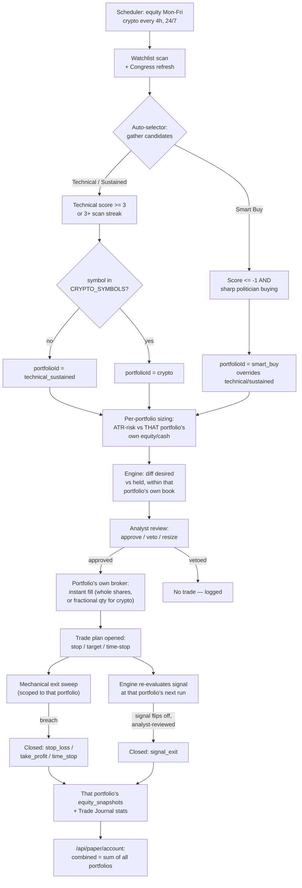
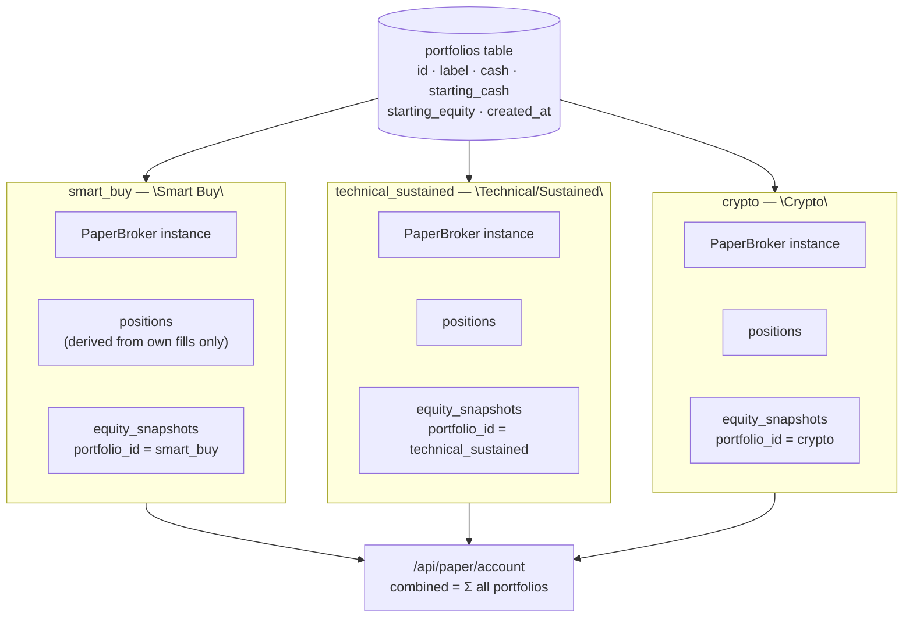
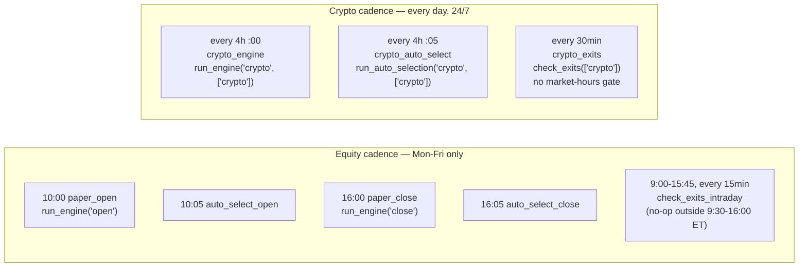
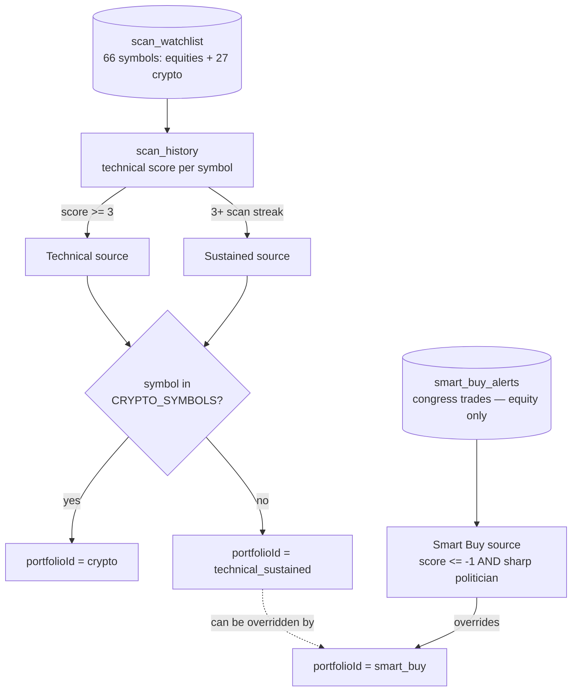
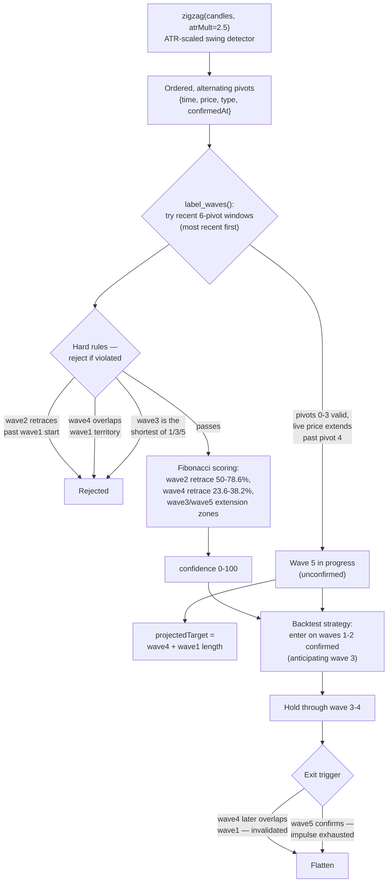

# Paper-Trading Strategy System — Full Specification

This document specifies the complete auto-trading system implemented in `backend/app/trading/` and `backend/app/analysis/`, in enough detail to be re-implemented from scratch. It covers: the multi-portfolio account model, candidate sourcing, scoring, strategy signals, position sizing, order review, execution, and exit management.

---

## Executive Overview

At a high level, this is a **fully automated paper-trading loop running three independent strategy portfolios**: Smart Buy (congressional-trade-driven, contrarian), Technical/Sustained (chart-driven, trend-following), and Crypto (chart-driven, 24/7). Each portfolio has its own real cash balance, its own positions, and its own equity curve — none of them compete for the same dollars, and a symbol can be held independently by more than one portfolio at once. Each scans its own candidate sources for setups, sizes and files trades against its own capital, has each trade reviewed by an AI risk analyst before it fills, and manages every open position mechanically until it exits. No human is in the loop for any individual trade decision — the system runs unattended on a schedule and logs its reasoning at every step for later review in the Trade Journal.

### The components, and what each one owns

| Component | File(s) | Responsibility |
|---|---|---|
| **Data & indicators** | `data/client.py`, `analysis/indicators.py` | Fetches OHLCV bars and quotes (equities via yfinance/Polygon, crypto via yfinance's `-USD` ticker format — same client, no special-casing) and computes RSI, ATR, MACD, SMA/EMA, Bollinger bands, and the derived `compute_signals()` summary that everything downstream reads from. |
| **Watchlist scanner** | `routers/scan.py` | Runs `compute_signals()` against the watchlist (66 symbols: equities + 27 crypto tickers) on a schedule, turns the result into an integer **technical score** (§4), and persists it to `scan_history` — the raw material for both the Technical and Sustained signal sources, for every portfolio. |
| **Congress data pipeline** | `data/congress.py`, `routers/congress.py` | Tracks politician trades, computes each politician's historical win rate, rolls that up per-ticker into a **quality tier** (sharp/mixed/weak), and flags **contrarian "smart buy"** tickers. Equity-only — crypto isn't covered by congressional disclosures. |
| **Auto-selector** | `trading/auto_selector.py` | The orchestration brain. Gathers candidates from all signal sources (§3), ranks them, tags each with its target `portfolioId` at gather time, sizes positions by ATR-based risk (§7) against **that portfolio's own** equity/cash, and creates strategy instances — fully independent per portfolio, no cross-portfolio balancing. |
| **Strategy functions** | `analysis/backtest.py` | Pure functions that turn a bar history into a desired position (long/flat/short) for one instance. 23 strategies total (including a rule-validated Elliott Wave pattern detector); 5 that cross-reference SPY/VIX/TLT are excluded from the crypto portfolio (§6). |
| **Analyst (AI risk gate)** | `trading/analyst.py` | A real LLM call that reviews every proposed order — macro context, dealer gamma positioning, **the proposing instance's own portfolio state** (not the whole account) — and can veto it, shrink its size, or adjust its stop/target within sanity bounds. Fails open (auto-approves) if the CLI is unavailable. |
| **Engine** | `trading/engine.py` | Diffs each instance's desired position against what's actually held **within its own portfolio**, sizes the order (whole shares for equities, fractional for crypto — §7/§9), routes through the analyst, submits fills to that portfolio's broker, and opens/closes trade-plan records. |
| **Mechanical exits** | `trading/exits.py` | A separate, tighter-cadence sweep that enforces stop-loss/take-profit/time-stop with no analyst involvement, scoped per portfolio — deliberately ungated so risk-reducing exits are never delayed by an AI call. |
| **Broker** | `trading/broker.py` | A `PaperBroker` **per portfolio** (registry keyed by `portfolio_id`, lazily created) — instant fills at the latest quote, cash/position bookkeeping scoped to that portfolio only. Swappable for a real broker via the same interface. |
| **Scheduler** | `trading/scheduler.py` | Wires all of the above to the clock. Equity portfolios run Mon–Fri on the regular market-hours cadence (§2); Crypto runs on its own 24/7 cadence, scoped so it never redundantly re-touches equity instances. |
| **Store & reporting** | `trading/store.py`, `routers/paper.py` | SQLite persistence — a `portfolios` table (§1) plus a `portfolio_id` column denormalized onto every instance/order/fill/trade-plan — and the Trade Journal's derived per-portfolio stats (win rate, Sharpe, drawdown, annualized return, S&P 500 benchmark — §12). |

### How a trade actually happens, end to end



The three signal sources (Technical/Sustained, Smart Buy, Crypto) feed the same downstream sizing/execution/exit pipeline but never compete for capital — each is tagged with its target portfolio at candidate-gather time and every step from there on (equity/cash check, sizing, order creation, fill, trade-plan lifecycle, equity snapshot) operates against that one portfolio's own state. The sections below specify each box in this diagram exactly, starting with the portfolio model itself.

---

## 1. Portfolio Model

Three independent portfolios, each with its own cash, positions, and equity curve — no pooled account, no cross-portfolio balancing:



- **Equity** = cash + market value of that portfolio's own open positions (marked at latest quote). **Positions** are derived from the running sum of *that portfolio's own* fills only — two portfolios can independently hold the same symbol and never see each other's side of it (see `GET /api/paper/overlap` for cross-portfolio visibility into that).
- **`starting_cash`** is the pure cash reserve a `reset_portfolio()` call restores cash to. **`starting_equity`** is the day-1 total-value baseline (cash + any carried-over positions) used to measure `totalPnl`/`totalPnlPct` — they diverge when a portfolio is seeded with pre-existing history (Smart Buy and Technical/Sustained were originally split out of one older pooled account; Crypto was not).
- **No fees, no commissions, no slippage model.** Orders fill instantly at the last available quote (§11).
- A new portfolio (e.g. a future 4th strategy) defaults to a clean **$10,000** starting balance (`DEFAULT_PORTFOLIO_STARTING_CASH`) unless explicitly seeded otherwise — this is how Crypto was added: `create_portfolio("crypto", "Crypto")`, no history to carve up, no proportional-split math needed.
- **Combined view** (`/api/paper/account`'s `combined` field): every real number just summed across all three portfolios — equity, cash, positions list, starting values, P&L.

### Bucket classification (`store.py`)

```python
BUCKET_SMART_BUY           = "smart_buy"
BUCKET_TECHNICAL_SUSTAINED = "technical_sustained"
BUCKET_CRYPTO              = "crypto"

def bucket_of_tags(tags):
    if tags and "crypto" in tags:            return BUCKET_CRYPTO
    if tags and "smart_buy" in tags:         return BUCKET_SMART_BUY
    return BUCKET_TECHNICAL_SUSTAINED
```

This is a **fallback path only** — every instance, order, fill, and trade plan carries an explicit `portfolio_id` column, stamped at creation time by whichever code path created it (the auto-selector, a manual instance-create call, etc.). `bucket_of_tags()` only matters if that ever gets skipped; it's never the primary routing mechanism.

---

## 2. Scheduling

Equity portfolios (Smart Buy, Technical/Sustained) run on an `AsyncIOScheduler` in `America/New_York`, Monday–Friday, no holiday calendar. Crypto runs on its own 24/7 cadence — every job below is either unscoped (touches every portfolio, unchanged from before the split) or explicitly scoped to `portfolio_ids=["crypto"]` so the two cadences never redundantly re-touch each other's instances:



| Job | Schedule | Scope | Action |
|---|---|---|---|
| `paper_open` | Mon–Fri 10:00 ET | all portfolios | `run_engine("open")` |
| `auto_select_open` | Mon–Fri 10:05 ET | all portfolios | refresh smart-buy alerts, then `run_auto_selection("open")` |
| `paper_close` | Mon–Fri 16:00 ET | all portfolios | `run_engine("close")` |
| `auto_select_close` | Mon–Fri 16:05 ET | all portfolios | refresh smart-buy alerts, then `run_auto_selection("close")` |
| `check_exits_intraday` | Mon–Fri, every 15 min, 9:00–15:45 ET | all portfolios | mechanical sweep (no-ops outside 9:30–16:00 market hours) |
| `crypto_engine` | every day, every 4h on the hour | `portfolio_ids=["crypto"]` | `run_engine("crypto", ...)` |
| `crypto_auto_select` | every day, every 4h at :05 | `portfolio_ids=["crypto"]` | `run_auto_selection("crypto", ...)` |
| `crypto_exits` | every day, every 30 min | `portfolio_ids=["crypto"]` | `check_exits(...)` — no market-hours gate, crypto never closes |
| `cot_refresh` | Friday 16:15 ET | n/a | refresh CFTC Commitment-of-Traders cache (unrelated to trading decisions) |

The `portfolio_ids` scope filter is an optional parameter on `run_engine()`, `check_exits()`, and `run_auto_selection()` — `None` (the equity jobs' default) evaluates everything, unchanged from before Crypto existed; a scoped call filters `store.list_instances()`/`store.open_plans()`/`store.list_portfolios()` down to just the given portfolio ids before doing anything, including the mark-to-market loop (so a crypto tick doesn't write redundant `equity_snapshot` rows for the untouched equity portfolios).

A manual "Run Now" (`kind="manual"`) triggers the same `run_engine()` path outside the schedule, unscoped (all portfolios).

---

## 3. Candidate Sourcing (`auto_selector.py`)

Candidates are gathered and merged by ticker symbol into a candidate dict, each tagged with a target `portfolioId`. A ticker can carry multiple source tags.



### 3a. Technical
From `scan_history`, tickers scanned in the **last 4 hours** with `score >= TECH_MIN_SCORE (3)`, ordered by score descending, capped at top 30.

### 3b. Sustained
From `scan_history` over the **last 90 days**, group by symbol, walk each symbol's scans newest-first and count a **consecutive streak** of scans with `score >= SUSTAINED_MIN_SCORE (2)` (streak breaks on the first scan below threshold). Qualifies if `streak >= SUSTAINED_MIN_STREAK (3)`.

**Portfolio routing for 3a/3b**: no separate "crypto source" exists — Technical and Sustained already work off whatever's in the watchlist, equity or crypto alike. The only difference is which portfolio the resulting candidate is tagged with: `_portfolio_for(symbol)` returns `BUCKET_CRYPTO` if the symbol is in the validated `CRYPTO_SYMBOLS` set, else `BUCKET_TECHNICAL_SUSTAINED`.

### 3c. Smart Buy (contrarian, equity-only)
From `smart_buy_alerts`, alerts detected in the **last 30 days** (`SMART_BUY_MAX_DAYS`), deduped by ticker (most recent). An alert exists for a ticker when, at detection time:
```
technical_score <= -1   AND   politician "quality" == "sharp"
```
where **quality** is derived from the average effective win-rate across every politician who bought the ticker:
```
avg_wr >= 65        → "sharp"
45 <= avg_wr < 65    → "mixed"
avg_wr < 45          → "weak"
avg_wr is None       → "unknown"
```
A politician's **effective win-rate** is their `realizedWinRate` (wins / trades on positions actually closed) if they have ≥2 realized trades, else their overall lifetime `winRate`. `investorQualityScore` = the ticker's `avg_wr` (rounded to 1 decimal). `avgAnnualizedGain` = mean of contributing politicians' average annualized returns; `maxAnnualizedGain` = the max across them. Candidates from this source always get `portfolioId = BUCKET_SMART_BUY`, overriding a Technical/Sustained tag if the symbol also qualified there. This source structurally never applies to crypto — congressional trade disclosures don't cover it.

### 3d. Cross-reference tags (informational, don't gate eligibility or change portfolio routing)
- `smart_universe`: ticker appears in the top-2 ranked sectors of the Smart Universe cache.
- `congress`: added to a **non-smart-buy** candidate if a politician bought it with `maxAnnualizedGain >= CONGRESS_MIN_ANN_RETURN (60.0)` and quality in `{"sharp", "mixed"}`.

### The crypto universe
27 validated symbols (`CRYPTO_SYMBOLS` in `auto_selector.py`), seeded into `scan_watchlist` so the periodic scanner keeps their technical scores current: `BTC-USD, ETH-USD, SOL-USD, XRP-USD, BNB-USD, ADA-USD, DOGE-USD, AVAX-USD, DOT-USD, LINK-USD, LTC-USD, BCH-USD, ATOM-USD, XLM-USD, ETC-USD, FIL-USD, ARB-USD, OP-USD, NEAR-USD, ICP-USD, HBAR-USD, ALGO-USD, AAVE-USD, MKR-USD, SAND-USD, TRX-USD, INJ-USD`. Three originally-proposed tickers (`MATIC-USD`, `UNI-USD`, `APT-USD`) had no accessible Yahoo/Polygon data at validation time and were dropped.

### Eligibility filter (per portfolio)
A candidate is dropped from a given portfolio's selection pass if its symbol already has an open trade plan or an enabled instance **within that same portfolio** — a symbol blocked in one portfolio never blocks another from independently entering it.

---

## 4. Technical Score (`scan.py`)

Computed per symbol from 2 years of daily bars via `indicators.compute_signals()`. Integer score, range roughly −5..+5:

```python
score = 0
if trend == "uptrend":       score += 2
elif trend == "downtrend":   score -= 2
if cross == "golden_cross":  score += 1
elif cross == "death_cross": score -= 1
if macdAboveSignal is True:  score += 1
elif macdAboveSignal is False: score -= 1
if rsi < 30:  score += 1
elif rsi > 70: score -= 1
```

Where (from `indicators.py`):
- **trend**: "uptrend" if `close > SMA50 AND close > SMA200 AND SMA50 > SMA200`; "downtrend" if all three comparisons are false; else "neutral".
- **recentCross**: "golden_cross" / "death_cross" if `sign(SMA50 − SMA200)` flipped positive/negative within the last 11 bars, else null.
- **macdAboveSignal**: boolean, MACD line vs signal line (see §5 for MACD formula).
- **rsi**: RSI(14), Wilder-smoothed.
- **momentum**: "overbought" if RSI ≥ 70, "oversold" if RSI ≤ 30, else "neutral".
- **bollingerStretch**: `(close − BB_mid) / (BB_width / 2)`, Bollinger(20, 2.0σ).
- **atrPct**: `ATR(14) / close × 100`.

This math is asset-agnostic — it runs identically on crypto's 7-day-a-week daily bars as on equities' 5-day bars; a 50-day SMA is still a 50-day SMA regardless of how many bars a week feed it. This score is recorded to `scan_history` on every scheduled/manual scan and is the sole gate for Technical/Sustained sourcing (§3a/3b) and the sole "weak chart" signal for Smart Buy's contrarian gate (§3c).

---

## 5. Indicator Formulas (`indicators.py`)

- **RSI(length=14)**: Wilder-style — `avgGain`/`avgLoss` via `ewm(alpha=1/length, min_periods=length)` on clipped positive/negative price changes; `RSI = 100 − 100/(1 + avgGain/avgLoss)`.
- **ATR(length=14)**: True range = `max(H−L, |H−prevClose|, |L−prevClose|)`, then `ewm(alpha=1/length, min_periods=length)`.
- **MACD(fast=12, slow=26, signal=9)**: `line = EMA(close, fast) − EMA(close, slow)`; `signal_line = EMA(line, signal)` — both via `ewm(span=...)` (not `adjust=False`).
- **EMA9 / EMA21**: `close.ewm(span=9|21).mean()`.
- **Bollinger(20, 2.0)**: standard SMA(20) ± 2×rolling std.

---

## 6. Strategy Functions (`backtest.py`)

Strategies operate on 2 years of daily bars. **Signal is computed on the close of bar N; the resulting position is intended to be executed at the close of bar N+1** (no look-ahead). `pos_series.iloc[-1]` (the latest value) is what the engine reads to determine desired position. 23 strategies total.

### `ema_cross_9_21` — "EMA cross (9/21)"
```python
fast = close.ewm(span=params.get("fast", 9), adjust=False).mean()
slow = close.ewm(span=params.get("slow", 21), adjust=False).mean()
position = 1.0 if fast > slow else 0.0   # long/flat only, never short
```
- Default params: `{"fast": 9, "slow": 21}`.
- `maxHoldDays`: 30 (used as the default time-stop).

### `rsi_revert` — "RSI mean reversion"
```python
r = RSI(close, params.get("length", 14))
position = NaN initially
position[r < params.get("buyBelow", 30)] = 1.0
position[r > params.get("exitAbove", 50)] = 0.0
position = position.forward_fill().fillna(0)   # holds prior state between triggers
```
- Default params: `{"length": 14, "buyBelow": 30, "exitAbove": 50}`.
- `maxHoldDays`: 20.
- **Smart Buy override**: `buyBelow` is loosened from 30 to **45** for Smart Buy instances specifically (`SMART_BUY_RSI_ENTRY = 45`) — the contrarian thesis is congressional conviction, not a second oversold trigger stacked on top, so entry is loosened to convert more candidates into actual filled positions.

### `elliott_wave` — "Elliott Wave (wave 3 entry)" (`analysis/elliott.py`)

The one strategy in the registry that isn't a simple vectorized indicator — it's a discrete, rule-validated pattern detector. Elliott Wave is inherently subjective (professional analysts disagree on the count for the same chart), so this is a heuristic: **hard structural rules reject a count outright**, **Fibonacci-ratio guidelines only score and rank the survivors**. Every API response and the strategy's own behavior carry that caveat forward — this is one plausible count, not an authoritative read.



- **`zigzag()`** is causal by construction: a pivot is only emitted once price has actually reversed past it by `atrMult × ATR(14)` — `confirmedAt` (the bar where that reversal crossed threshold) is tracked separately from the pivot's own extreme bar, so the backtest strategy below can walk the list bar-by-bar with no look-ahead.
- **Search order**: an in-progress wave 5 at the current tail is checked first (most actionable — "we're in the middle of something now"); failing that, the search slides backward through completed 6-pivot windows and takes the most recent one that validates, since real price data is choppy and the single most-recent window rarely forms a clean textbook impulse.
- **As a strategy**: walks confirmed pivots chronologically, entering (long or short — `supportsShort: True`) once a fresh waves-1-2 setup validates, holding through the anticipated wave 3-4, and flattening on wave-4 invalidation or wave-5 completion. Not excluded from crypto (`CRYPTO_INCOMPATIBLE_STRATEGIES`) — it's pure price-action with no cross-asset reference.
- **As a standalone analysis view**: `GET /api/ticker/{symbol}/elliott-wave` exposes the same engine for manual chart reading — a toggle on the Ticker Analysis page, off by default, drawing the raw zigzag (muted dashed line), the labeled wave count (colored line + numbered markers), and a projected wave-5 target when applicable.

### Strategy assignment rule (`auto_selector._pick_strategy`)
```python
if signal_type == "smart_buy":          strategy = "rsi_revert"   (with buyBelow=45)
elif rsi is not None and rsi < 35:      strategy = "rsi_revert"   (oversold technical)
else:                                    strategy = "ema_cross_9_21"
```
Both auto-selected strategies are pure technical indicators with no cross-asset reference, so this rule needs no crypto-specific branch — auto-selected crypto candidates are strategy-safe automatically.

### Crypto strategy exclusions (`CRYPTO_INCOMPATIBLE_STRATEGIES`)
5 of the 23 registered strategies internally fetch an equity-specific instrument and are economically meaningless for a crypto symbol — excluded from the auto-deploy "backtest every strategy, pick the best Sharpe" loop whenever the target portfolio is crypto:

| Strategy | Cross-references |
|---|---|
| `dual_momentum` | SPY (relative momentum) |
| `dual_momentum_bond` | SPY, TLT |
| `sma_bond_rotate` | TLT (rotate into bonds when flat) |
| `rsi_revert_vix` | `^VIX` (regime filter) |
| `bollinger_vix` | `^VIX` (regime filter) |

These strategies fail *safely* if manually applied to a crypto instance anyway (the VIX-filtered ones fall back to their unfiltered base if the merge/fetch comes up empty) — the exclusion is about not offering a nonsensical "best strategy" pick, not about preventing a crash.

---

## 7. Position Sizing (`auto_selector.py` + `engine.py`)

```
risk_pct       = 0.005 if smart_buy else 0.01     # 0.5% vs 1% of equity risked per trade
dollar_risk    = equity × risk_pct                 # equity = THIS candidate's target portfolio's own equity
shares         = dollar_risk / (2 × ATR14)
allocation_usd = min(shares × price, equity × 0.10)   # hard cap: 10% of equity per position
```
Skipped if `allocation_usd < price` (can't afford 1 share/coin at the sizing stage — the actual fill-time rounding is asset-aware, see below).

### No cross-portfolio balancing
Each portfolio only ever spends its own cash, sized against its own equity, up to its own 10%-per-position cap. There's no analogue of an old "cap Smart Buy at 50% of deployed capital, interleave picks by proportional share" mechanism — that only existed when all strategies shared one pooled account, and was deleted once each got real independent capital. Candidates are simply taken best-score-first per portfolio, gated only by that portfolio's own cash-floor check below.

### Pre-trade guardrails (per portfolio)
- Skip the entire cycle **for that portfolio** if `cash / equity < 0.10` (10% cash floor) — a low-cash Smart Buy doesn't block Crypto or Technical/Sustained from trading.
- Cap a single batch at 50 candidates per portfolio (first-run runaway protection).
- Never re-enter a symbol with an existing open plan or enabled instance **in that same portfolio**.

### Fill-time qty rounding (`engine.py`) — the asset-class split
```python
def _round_qty(raw_qty, portfolio_id):
    if portfolio_id == BUCKET_CRYPTO:
        return round(raw_qty, 6)      # fractional — a $500 allocation into $60k+ BTC needs this
    return math.floor(raw_qty)        # whole shares for equities, unchanged
```
Equities size in whole shares (unchanged from before Crypto existed). Crypto sizes to 6 decimal places — the same precision `store.py` already uses when deriving position quantities from fills — since a single coin can be worth tens of thousands of dollars and most allocations buy a small fraction of one. The minimum viable size is `1` share for equities, `1e-6` for crypto; anything below that is rejected (new entries) or vetoed (analyst-resized orders), same logic, portfolio-aware threshold.

---

## 8. Order Review — the "Analyst" (`analyst.py`)

Every proposed order (new entries **and** signal-driven exits) is reviewed by a real LLM call before execution — this is not deterministic rule logic.

- **Mechanism**: shells out to the local `claude` CLI (`subprocess.run(["claude", "-p", prompt, "--output-format", "json", "--model", <model>, "--tools", "", "--no-session-persistence", "--safe-mode", "--json-schema", <schema>])`), timeout 120s. `--tools ""` forces a single pure-text turn (no tool use); `--safe-mode` skips project memory/hooks discovery.
- **Framing**: system rules frame it as "a risk-review analyst for a PAPER trading simulator," instructed to **approve unless context clearly argues against the trade** (bias toward letting the mechanical signal through), with side-specific extra instructions for BUY / SHORT / SELL / COVER.
- **Context supplied to the model** (JSON blob): the proposed order, the strategy's signal context (trend/RSI/MACD/levels from `compute_signals`), the instance's allocation and params, mechanical stop/target defaults, a macro snapshot (risk composite, yield curve, dispersion), dealer gamma positioning (spot, net GEX, flip point, max pain, key levels), and **the proposing instance's own portfolio's cash + positions** (not the combined account) — so the review reflects that portfolio's actual book, not cross-portfolio exposure that isn't real for it.
- **Verdict schema**: `"approve"` or `"veto"`, plus `sizeFactor` (0.0–1.0, forced to 0.0 on veto). For new entries (BUY/SHORT) the model must also return `stop_loss`, `take_profit`, `max_hold_days` (1–365), `thesis`, `exit_plan`.
- **Mechanical defaults** the model is told to work from: `stop = entry − 2×ATR`, `target = entry + 3×ATR` for longs (inverted for shorts). The model's stop/target are **clamped** server-side: stop must be 0.5×–4×ATR from entry on the correct side; target must be beyond current price on the correct side; `max_hold_days` must be 1–365 — any out-of-range value falls back to the mechanical default.
- **SELL/COVER** (exits) never veto for market-risk reasons (only for genuine data-quality problems) and ignore `sizeFactor` — exits always close the full held quantity.
- **Failure fallback**: any error (CLI missing, timeout, bad JSON, malformed response) returns `{"verdict": "approve", "sizeFactor": 1.0, "rationale": "Analyst unavailable — mechanical signal executed unreviewed.", "model": None}` — the system always proceeds rather than blocking on analyst failure, defaulting to full-size, mechanical-defaults execution.

---

## 9. Entry / Exit Execution (`engine.py`)

Each engine run (`run_engine(kind, portfolio_ids=None)`) does, in order:

### Step 1 — Mechanical exit sweep (§10) runs first, unconditionally, before any new signals are evaluated — scoped to the same `portfolio_ids` if given.

### Step 2 — For each enabled instance in scope (all, or filtered to `portfolio_ids`):
1. Recompute the strategy's desired position (`1`/`0`/`−1`) from the latest 2y daily bars.
2. Compare to currently held qty **within that instance's own portfolio** (from that portfolio's broker, signed: +long/−short/0 flat).
3. Determine action:

| Held | Desired | Action |
|---|---|---|
| 0 | > 0 | BUY (open long) |
| 0 | < 0 | SHORT (open short) |
| > 0 | ≤ 0 | SELL (close long) |
| < 0 | ≥ 0 | COVER (close short) |
| else | | hold, no action |

*(Reversals are two-step: long→short sells first, then shorts on the following run once flat; same for short→long.)*

4. **Sizing**: for opens, `qty = _round_qty(allocation_usd / price, portfolio_id)` — whole-floored for equities, 6-decimal-rounded for crypto (§7); skip if below that portfolio's minimum viable qty. For closes, `qty = abs(held)` (always closes the full position).
5. Create an order record (stamped with the instance's `portfolio_id`), compute mechanical stop/target defaults (§8), send to the analyst for review.
6. If **vetoed** or sized to zero by the analyst → order marked `vetoed`, nothing executes.
7. Otherwise → submit market order to **that portfolio's own broker** (§11). Approved size for opens is `_round_qty(qty × analyst_sizeFactor, portfolio_id)`; closes always use the full `abs(held)` regardless of `sizeFactor`.
8. **On a new open fill**: create a trade plan (stamped with `portfolio_id`) — entry price/qty from the fill, stop/target/max-hold-days from the analyst (if it provided a full thesis) or the mechanical defaults, `levels_source` tagged `"analyst"` or `"mechanical"` accordingly, plus the written thesis/exit-plan text.
9. **On a close fill** (`side in {sell, cover}`): every open trade plan for that symbol **within that same portfolio** is closed with `exit_reason = "signal_exit"` — a same-symbol plan in a *different* portfolio is never touched, since portfolios can independently hold the same symbol.

### Step 3 — Mark every in-scope portfolio to market (unconditional per run, cheap — a handful of portfolios), recording an `equity_snapshots` row for each.

---

## 10. Mechanical Exits (`exits.py`)

Checked on the schedule in §2 (equity: every 15 min during market hours; crypto: every 30 min, 24/7) and once at the start of every engine run in that same scope, no analyst review. For each open plan **in scope**, fetch the latest quote and check, **in priority order**:

```
Long:
  price <= stop_loss   → "stop_loss"
  price >= take_profit → "take_profit"
Short (inverted):
  price >= stop_loss   → "stop_loss"
  price <= take_profit → "take_profit"

Then (either direction):
  days_held >= max_hold_days → "time_stop"
```
`days_held` = business-day count (`numpy.busday_count`) from `opened_at` to today for equity portfolios; **calendar-day count** for crypto plans specifically — a business-day count would undercount real elapsed exposure across a weekend for an asset that never stops trading.

If triggered, the position is closed immediately at the current quote through **that plan's own portfolio's broker** — no analyst gate, "risk-reducing sells are never gated on anything." Quotes are ~15-min delayed, so fills can gap through the stated level rather than filling exactly at it.

---

## 11. Broker / Fill Model (`broker.py`)

```mermaid
flowchart LR
    E[engine.py / exits.py] -->|get_active_broker(portfolio_id)| REG{"_paper_brokers registry\n{portfolio_id: PaperBroker}"}
    REG -->|lazy-create if missing| SB2[PaperBroker\nsmart_buy]
    REG -->|lazy-create if missing| TS2[PaperBroker\ntechnical_sustained]
    REG -->|lazy-create if missing| CR2[PaperBroker\ncrypto]
```

- One `PaperBroker(portfolio_id)` instance per portfolio, held in a module-level registry (`get_paper_broker(portfolio_id)`, lazy-created and cached; `get_active_broker(portfolio_id)` is the entry point everything calls, transparently swapping to a real broker if one's ever configured — Alpaca, if used, stays a single non-portfolio-scoped broker since a real brokerage account doesn't naturally split into virtual sub-ledgers).
- **Fills instantly** at the latest available quote (`client.get_quote(symbol)["last"]`) — no partial fills, no order book, no slippage or commission model.
- `buy`: rejected if `cost > that portfolio's own cash`. `sell`: rejected if `qty > that portfolio's own held long qty`. `short`: no cash-headroom check (receives short-sale proceeds as cash). `cover`: rejected if `qty > that portfolio's own held short qty`.
- Every fill records to the `fills` table (with `portfolio_id`, used to derive that portfolio's net positions) and triggers `mark_to_market()`, which re-prices every position **that portfolio holds** at its latest quote, computes that portfolio's total equity, and snapshots `{portfolio_id, ts, equity, cash}`.

---

## 12. Data Model Summary (SQLite, `store.py`)

- **`portfolios`**: `id` (`smart_buy` / `technical_sustained` / `crypto`), `label`, `cash`, `starting_cash`, `starting_equity`, `created_at`, `enabled`. One row per strategy; see §1.
- **`instances`**: one row per active strategy deployment — `symbol`, `strategy`, `params` (JSON), `allocation_usd`, `enabled`, `portfolio_id`, `source_tags` (JSON list — `smart_buy`/`technical`/`sustained`/`congress`/`smart_universe`).
- **`orders`**, **`fills`**, **`trade_plans`**: all carry a denormalized `portfolio_id` column so a portfolio's full history survives even if the originating instance is later deleted. `trade_plans` additionally: `qty`, `entry_price`, `opened_at`, `stop_loss`, `take_profit`, `max_hold_days`, `levels_source` (`analyst`/`mechanical`), `thesis`, `exit_plan`, `status` (`open`/`closed`), `exit_price`, `exit_reason` (`stop_loss`/`take_profit`/`time_stop`/`signal_exit`), `closed_at`, `realized_pnl`, `realized_pnl_pct`, `direction` (`long`/`short`), analyst `verdict`/`size_factor`/`rationale`/`model`, `selection_thesis`, `selection_snapshot` (JSON — the raw signal values behind the pick).
- **`equity_snapshots`**: composite key `(portfolio_id, ts)` — `equity, cash` — one row per portfolio per `mark_to_market()` call. **`equity_snapshots_legacy`**: the original single-account curve, preserved read-only from before the portfolio split (used to backfill the "All sources" combined equity chart's pre-split history — see §1's frontend consumer).
- **`runs`**: one row per engine invocation — `kind` (`open`/`close`/`manual`/`crypto`), timing, proposed/filled/vetoed counts, errors.
- **`auto_select_runs`**: journal of every auto-selector invocation across every portfolio, including skipped/empty cycles, plus `bucket_totals` (dollar allocation currently committed, keyed by every live portfolio id — not hardcoded to two).
- **`scan_watchlist`** / **`scan_history`**: symbol-agnostic — the same tables serve equity and crypto technical scoring, distinguished only by which portfolio a scored symbol later gets routed to (§3).

---

## 13. Full Constant Reference

| Constant | Value | Meaning |
|---|---|---|
| `DEFAULT_PORTFOLIO_STARTING_CASH` | $10,000.00 | Default starting balance for a newly created portfolio with no history to inherit |
| `RISK_PCT_NORMAL` | 1% | Equity risked per Technical/Sustained trade |
| `RISK_PCT_SMART_BUY` | 0.5% | Equity risked per Smart Buy trade |
| `MAX_POSITION_PCT` | 10% | Max equity in any single position (per portfolio) |
| `MIN_CASH_PCT` | 10% | Skip new entries for a portfolio if its own cash falls below this share of its own equity |
| `TECH_MIN_SCORE` | 3 | Min technical score for Technical sourcing |
| `SUSTAINED_MIN_SCORE` | 2 | Score threshold counted toward a Sustained streak |
| `SUSTAINED_MIN_STREAK` | 3 | Consecutive qualifying scans required |
| `SMART_BUY_MAX_DAYS` | 30 | Max age of a smart-buy alert to still be actionable |
| `CONGRESS_MIN_ANN_RETURN` | 60% | Min politician annualized return to tag a non-Smart-Buy pick "congress" |
| `CONGRESS_TAG_MIN_QUALITY` | {sharp, mixed} | Quality tiers eligible for the "congress" tag |
| `SMART_BUY_RSI_ENTRY` | 45 | `rsi_revert` buyBelow override for Smart Buy instances (default 30) |
| Sharp investor threshold | ≥65% avg win rate | Gate for "sharp" politician quality |
| Mixed investor threshold | 45–65% avg win rate | "mixed" quality |
| `STOP_ATR_MULT` | 2.0× | Mechanical stop distance from entry |
| `TARGET_ATR_MULT` | 3.0× | Mechanical target distance from entry |
| `ema_cross_9_21` params | fast=9, slow=21 | EMA periods |
| `ema_cross_9_21` maxHoldDays | 30 trading days | Default time-stop |
| `rsi_revert` params | length=14, buyBelow=30, exitAbove=50 | RSI thresholds (buyBelow→45 for Smart Buy) |
| `rsi_revert` maxHoldDays | 20 trading days | Default time-stop |
| `CRYPTO_SYMBOLS` | 27 tickers | Validated crypto universe — routes Technical/Sustained candidates to the Crypto portfolio instead |
| `CRYPTO_INCOMPATIBLE_STRATEGIES` | 5 strategy ids | Excluded from crypto auto-deploy backtesting (SPY/VIX/TLT cross-references) |
| Crypto qty precision | 6 decimals, min 1e-6 | Fractional sizing for crypto vs. whole-share flooring for equities |
| Analyst CLI timeout | 120s | Falls back to auto-approve on timeout |
| Equity exit sweep cadence | every 15 min, 9:00–15:45 ET, Mon-Fri | Effective active window 9:30–15:45 (market-hours gated) |
| Equity auto-select cadence | 10:05 & 16:05 ET, Mon-Fri | Runs 5 min after the paper-engine open/close runs |
| Crypto engine/auto-select cadence | every 4h, every day | No market-hours gate |
| Crypto exit sweep cadence | every 30 min, every day | No market-hours gate |

---

## 14. Recreation Checklist

To rebuild this system from scratch, implement in this order:

1. **Data layer**: OHLCV history fetch + quote fetch for any symbol (equity or crypto ticker format — same client), with a caching layer.
2. **Indicators**: RSI(Wilder), ATR(Wilder), MACD, SMA50/200, EMA9/21, Bollinger(20,2) → `compute_signals()`.
3. **Technical scanner**: run `compute_signals` per watchlist symbol on a schedule, score per §4, persist to a scan-history table.
4. **Strategy functions**: `ema_cross_9_21` and `rsi_revert` per §6, returning a position series from a bars DataFrame. **Elliott Wave** (§6): a causal zigzag swing detector, then a rule-validated (hard rules) + Fibonacci-scored (soft ranking) wave-counting pass on top — usable both as a standalone chart-analysis endpoint and as a backtestable strategy.
5. **Politician/congress data pipeline**: per-politician win rate → per-ticker quality tier (§3c) → smart-buy alert table.
6. **Portfolio model**: a `portfolios` table (§1) — id/label/cash/starting_cash/starting_equity — and a `portfolio_id` column denormalized onto every instance/order/fill/trade-plan/equity-snapshot table, keyed to composite `(portfolio_id, ts)` for equity snapshots.
7. **Broker registry**: `PaperBroker(portfolio_id)` per portfolio, cash/position bookkeeping scoped to that portfolio's own fills only (§11).
8. **Auto-selector**: candidate gathering (§3), tagging each with a target `portfolioId` at gather time (technical/sustained default, smart-buy override, crypto-universe override) → scoring/ranking → per-portfolio ATR-based position sizing (§7) → instance creation.
9. **Analyst gate**: LLM review call with the approve/veto/size/level-clamp contract (§8), scoped to the proposing instance's own portfolio, with a safe auto-approve fallback on any failure.
10. **Engine**: desired-vs-held diffing within each instance's own portfolio, asset-aware qty rounding (whole shares vs. fractional crypto), order creation, analyst review, execution, trade-plan lifecycle (§9).
11. **Mechanical exit sweep**: stop/target/time-stop checker, no analyst gate, portfolio-scoped, running independently of the engine on a tighter interval (§10).
12. **Scheduler**: wire equity portfolios to the Mon-Fri market-hours timetable (§2); wire any 24/7 asset class (crypto) to its own unscoped-time cadence, using an optional `portfolio_ids` filter on steps 8–11 so the two cadences never redundantly re-touch each other.
13. **Reporting**: per-portfolio trade stats, Sharpe/drawdown/CAGR from either the portfolio's real equity curve (once it has enough history) or compounded closed-trade returns as a fallback, S&P 500 benchmark comparison over the matching window, plus a combined view summing every portfolio.

---

## Appendix: performance figures

The **"Performance so far"** figures that used to live in this document (single pooled $20,000 account, ~19 days) predate the portfolio split and are no longer representative — Smart Buy and Technical/Sustained now report separately from their own real equity curves, and Crypto has its own $10,000 track record starting from its creation date. Current numbers for any portfolio are always available live:

- `GET /api/paper/account` — real-time equity/cash/positions per portfolio, plus a combined view.
- `GET /api/paper/stats` — win rate, Sharpe, drawdown, annualized return, and S&P 500 benchmark, broken out per portfolio (`all` / `smartBuy` / `technicalSustained` / `crypto`).
- `GET /api/paper/equity` — per-portfolio equity curves, plus the preserved pre-split pooled curve (`legacy`).
- The Paper Trading and Trade Journal pages in the app render all of the above with a tab per portfolio.
