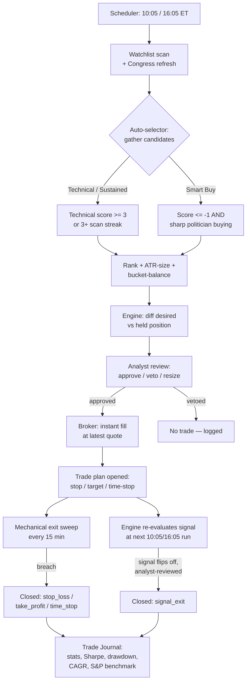

# Paper-Trading Strategy System — Full Specification

This document specifies the complete auto-trading system implemented in `backend/app/trading/` and `backend/app/analysis/`, in enough detail to be re-implemented from scratch. It covers: candidate sourcing, scoring, strategy signals, position sizing, order review, execution, and exit management.

---

## Executive Overview

At a high level, this is a **twice-daily, fully automated paper-trading loop**: it scans a watchlist for setups, cross-references congressional trading activity, sizes and files trades against a $20,000 simulated account, has each trade reviewed by an AI risk analyst before it fills, and then manages every open position mechanically until it exits. No human is in the loop for any individual trade decision — the system runs unattended on a schedule and simply logs its reasoning at every step for later review in the Trade Journal.

### The components, and what each one owns

| Component | File(s) | Responsibility |
|---|---|---|
| **Data & indicators** | `data/client.py`, `analysis/indicators.py` | Fetches OHLCV bars and quotes; computes RSI, ATR, MACD, SMA/EMA, Bollinger bands, and the derived `compute_signals()` summary (trend, momentum, crosses) that everything downstream reads from. |
| **Watchlist scanner** | `routers/scan.py` | Runs `compute_signals()` against the watchlist on a schedule, turns the result into an integer **technical score** (§4), and persists it to `scan_history` — the raw material for both the Technical and Sustained signal sources. |
| **Congress data pipeline** | `data/congress.py`, `routers/congress.py` | Tracks politician trades, computes each politician's historical win rate, rolls that up per-ticker into a **quality tier** (sharp/mixed/weak), and flags **contrarian "smart buy"** tickers where a sharp investor bought against a weak chart. |
| **Auto-selector** | `trading/auto_selector.py` | The orchestration brain, run at 10:05/16:05 ET. Gathers candidates from all three signal sources (§3), ranks them, sizes positions by ATR-based risk (§7), balances allocation between the Smart Buy and Technical/Sustained buckets, and creates strategy instances. |
| **Strategy functions** | `analysis/backtest.py` | Pure functions (`ema_cross_9_21`, `rsi_revert`) that turn a bar history into a desired position (long/flat/short) for one instance. |
| **Analyst (AI risk gate)** | `trading/analyst.py` | A real LLM call (via the local `claude` CLI) that reviews every proposed order — macro context, dealer gamma positioning, portfolio state — and can veto it, shrink its size, or adjust its stop/target within sanity bounds. Fails open (auto-approves) if the CLI is unavailable, so a broken analyst never blocks trading. |
| **Engine** | `trading/engine.py` | Diffs each instance's desired position against what's actually held, creates and routes orders through the analyst, submits fills to the broker, and opens/closes trade-plan records. |
| **Mechanical exits** | `trading/exits.py` | A separate, tighter-cadence sweep (every 15 min) that enforces stop-loss/take-profit/time-stop with no analyst involvement — deliberately ungated so risk-reducing exits are never delayed by an AI call. |
| **Broker** | `trading/broker.py` | The simulated fill engine: instant fills at the latest quote, cash/position bookkeeping, no fees or slippage. Swappable for a real broker via the same interface. |
| **Scheduler** | `trading/scheduler.py` | Wires all of the above to the clock (§2) — this is the only thing that actually kicks off a cycle; everything else is invoked by it (or manually, via the same entry points). |
| **Store & reporting** | `trading/store.py`, `routers/paper.py` | SQLite persistence for every order, fill, trade plan, and equity snapshot, plus the Trade Journal's derived stats (win rate, Sharpe, drawdown, annualized return, S&P 500 benchmark — §12). |

### How a trade actually happens, end to end



The two signal sources (Technical/Sustained and Smart Buy) feed the same downstream pipeline but represent opposite theses — one follows the chart, the other deliberately bets against it when a historically sharp politician disagrees with it — which is why they're tracked as separate portfolio buckets throughout sizing, execution, and reporting rather than merged into one undifferentiated trade list. Every other part of the pipeline (analyst review, broker fill, exit management) is shared and source-agnostic. The sections below specify each box in this diagram exactly.

---

## 1. Account Model

- **Starting cash**: $20,000.00 (`STARTING_CASH`).
- **Equity** = cash + market value of all open positions (marked at latest quote).
- **Positions**: signed quantity — positive = long, negative = short. Derived from the running sum of fills.
- **No fees, no commissions, no slippage model.** Orders fill instantly at the last available quote (see §7).
- An **equity snapshot** (`ts, equity, cash`) is recorded every time `mark_to_market()` runs (i.e., after every fill and at the end of every engine run).

---

## 2. Scheduling

All jobs run on an `AsyncIOScheduler` in the `America/New_York` timezone, Monday–Friday, no holiday calendar:

| Job | Time (ET) | Action |
|---|---|---|
| `paper_open` | 10:00 | `run_engine("open")` |
| `auto_select_open` | 10:05 | refresh smart-buy alerts, then `run_auto_selection("open")` |
| `paper_close` | 16:00 | `run_engine("close")` |
| `auto_select_close` | 16:05 | refresh smart-buy alerts, then `run_auto_selection("close")` |
| `check_exits_intraday` | every 15 min, 9:00–15:45 | mechanical stop/target/time-stop sweep (no-ops outside 9:30–16:00 market hours) |
| `cot_refresh` | Friday 16:15 | refresh CFTC Commitment-of-Traders cache (unrelated to trading decisions) |

A manual "Run Now" (`kind="manual"`) triggers the same `run_engine()` path outside the schedule.

---

## 3. Candidate Sourcing (`auto_selector.py`, runs at 10:05/16:05)

Three signal sources are gathered and merged by ticker symbol into a candidate dict. A ticker can carry multiple source tags.

### 3a. Technical
From `scan_history` (the watchlist scanner — see §4 for scoring), tickers scanned in the **last 4 hours** with `score >= TECH_MIN_SCORE (3)`, ordered by score descending, capped at top 30.

### 3b. Sustained
From `scan_history` over the **last 90 days**, group by symbol, walk each symbol's scans newest-first and count a **consecutive streak** of scans with `score >= SUSTAINED_MIN_SCORE (2)` (streak breaks on the first scan below threshold). Qualifies if `streak >= SUSTAINED_MIN_STREAK (3)`.

### 3c. Smart Buy (contrarian)
From `smart_buy_alerts`, alerts detected in the **last 30 days** (`SMART_BUY_MAX_DAYS`), deduped by ticker (most recent). An alert exists for a ticker when, at detection time:
```
technical_score <= -1   AND   politician "quality" == "sharp"
```
where **quality** is derived from the average effective win-rate across every politician who bought the ticker:
```
avg_wr >= 65        → "sharp"
45 <= avg_wr < 65    → "mixed"
avg_wr < 45          → "weak"
avg_wr is None       → "unknown"
```
A politician's **effective win-rate** is their `realizedWinRate` (wins / trades on positions actually closed) if they have ≥2 realized trades, else their overall lifetime `winRate`. `investorQualityScore` = the ticker's `avg_wr` (rounded to 1 decimal). `avgAnnualizedGain` = mean of contributing politicians' average annualized returns; `maxAnnualizedGain` = the max across them.

### 3d. Cross-reference tags (informational, don't gate eligibility)
- `smart_universe`: ticker appears in the top-2 ranked sectors of the Smart Universe cache.
- `congress`: added to a **non-smart-buy** candidate if a politician bought it with `maxAnnualizedGain >= CONGRESS_MIN_ANN_RETURN (60.0)` and quality in `{"sharp", "mixed"}`.

### Eligibility filter
A candidate is dropped if its symbol already has an open trade plan or an enabled instance ("blocked").

---

## 4. Technical Score (`scan.py`)

Computed per symbol from 2 years of daily bars via `indicators.compute_signals()`. Integer score, range roughly −5..+5:

```python
score = 0
if trend == "uptrend":       score += 2
elif trend == "downtrend":   score -= 2
if cross == "golden_cross":  score += 1
elif cross == "death_cross": score -= 1
if macdAboveSignal is True:  score += 1
elif macdAboveSignal is False: score -= 1
if rsi < 30:  score += 1
elif rsi > 70: score -= 1
```

Where (from `indicators.py`):
- **trend**: "uptrend" if `close > SMA50 AND close > SMA200 AND SMA50 > SMA200`; "downtrend" if all three comparisons are false; else "neutral".
- **recentCross**: "golden_cross" / "death_cross" if `sign(SMA50 − SMA200)` flipped positive/negative within the last 11 bars, else null.
- **macdAboveSignal**: boolean, MACD line vs signal line (see §5 for MACD formula).
- **rsi**: RSI(14), Wilder-smoothed.
- **momentum**: "overbought" if RSI ≥ 70, "oversold" if RSI ≤ 30, else "neutral".
- **bollingerStretch**: `(close − BB_mid) / (BB_width / 2)`, Bollinger(20, 2.0σ).
- **atrPct**: `ATR(14) / close × 100`.

This score is recorded to `scan_history` on every scheduled/manual scan and is the sole gate for Technical/Sustained sourcing (§3a/3b) and the sole "weak chart" signal for Smart Buy's contrarian gate (§3c).

---

## 5. Indicator Formulas (`indicators.py`)

- **RSI(length=14)**: Wilder-style — `avgGain`/`avgLoss` via `ewm(alpha=1/length, min_periods=length)` on clipped positive/negative price changes; `RSI = 100 − 100/(1 + avgGain/avgLoss)`.
- **ATR(length=14)**: True range = `max(H−L, |H−prevClose|, |L−prevClose|)`, then `ewm(alpha=1/length, min_periods=length)`.
- **MACD(fast=12, slow=26, signal=9)**: `line = EMA(close, fast) − EMA(close, slow)`; `signal_line = EMA(line, signal)` — both via `ewm(span=...)` (not `adjust=False`).
- **EMA9 / EMA21**: `close.ewm(span=9|21).mean()`.
- **Bollinger(20, 2.0)**: standard SMA(20) ± 2×rolling std.

---

## 6. Strategy Functions (`backtest.py`)

Strategies operate on 2 years of daily bars. **Signal is computed on the close of bar N; the resulting position is intended to be executed at the close of bar N+1** (no look-ahead). `pos_series.iloc[-1]` (the latest value) is what the engine reads to determine desired position.

### `ema_cross_9_21` — "EMA cross (9/21)"
```python
fast = close.ewm(span=params.get("fast", 9), adjust=False).mean()
slow = close.ewm(span=params.get("slow", 21), adjust=False).mean()
position = 1.0 if fast > slow else 0.0   # long/flat only, never short
```
- Default params: `{"fast": 9, "slow": 21}`.
- `maxHoldDays`: 30 (used as the default time-stop).

### `rsi_revert` — "RSI mean reversion"
```python
r = RSI(close, params.get("length", 14))
position = NaN initially
position[r < params.get("buyBelow", 30)] = 1.0
position[r > params.get("exitAbove", 50)] = 0.0
position = position.forward_fill().fillna(0)   # holds prior state between triggers
```
- Default params: `{"length": 14, "buyBelow": 30, "exitAbove": 50}`.
- `maxHoldDays`: 20.
- **Smart Buy override**: `buyBelow` is loosened from 30 to **45** for Smart Buy instances specifically (`SMART_BUY_RSI_ENTRY = 45`) — the contrarian thesis is congressional conviction, not a second oversold trigger stacked on top, so entry is loosened to convert more candidates into actual filled positions.

### Strategy assignment rule (`auto_selector._pick_strategy`)
```python
if signal_type == "smart_buy":          strategy = "rsi_revert"   (with buyBelow=45)
elif rsi is not None and rsi < 35:      strategy = "rsi_revert"   (oversold technical)
else:                                    strategy = "ema_cross_9_21"
```

---

## 7. Position Sizing (`auto_selector.py`)

```
risk_pct       = 0.005 if smart_buy else 0.01     # 0.5% vs 1% of equity risked per trade
dollar_risk    = equity × risk_pct
shares         = dollar_risk / (2 × ATR14)
allocation_usd = min(shares × price, equity × 0.10)   # hard cap: 10% of equity per position
```
Skipped if `allocation_usd < price` (can't afford 1 share).

### Portfolio balance across buckets
Smart Buy is capped at **50%** of total deployed capital (`SMART_BUY_MAX_SHARE`). Sized candidates from both buckets (each already sorted best-score-first within its bucket) are interleaved: at each step, whichever bucket is proportionally furthest below its target share (`current_allocation / max_share`) gets the next pick. If one bucket runs out of eligible candidates, the other keeps filling with remaining cash.

### Pre-trade guardrails
- Skip the entire cycle if `cash / equity < 0.10` (10% cash floor).
- Cap a single batch at 50 candidates (first-run runaway protection).
- Never re-enter a symbol with an existing open plan or enabled instance.

---

## 8. Order Review — the "Analyst" (`analyst.py`)

Every proposed order (new entries **and** signal-driven exits) is reviewed by a real LLM call before execution — this is not deterministic rule logic.

- **Mechanism**: shells out to the local `claude` CLI (`subprocess.run(["claude", "-p", prompt, "--output-format", "json", "--model", <model>, "--tools", "", "--no-session-persistence", "--safe-mode", "--json-schema", <schema>])`), timeout 120s. `--tools ""` forces a single pure-text turn (no tool use); `--safe-mode` skips project memory/hooks discovery.
- **Framing**: system rules frame it as "a risk-review analyst for a PAPER trading simulator," instructed to **approve unless context clearly argues against the trade** (bias toward letting the mechanical signal through), with side-specific extra instructions for BUY / SHORT / SELL / COVER.
- **Context supplied to the model** (JSON blob): the proposed order, the strategy's signal context (trend/RSI/MACD/levels from `compute_signals`), the instance's allocation and params, mechanical stop/target defaults, a macro snapshot (risk composite, yield curve, dispersion), dealer gamma positioning (spot, net GEX, flip point, max pain, key levels), and the current portfolio (cash + positions).
- **Verdict schema**: `"approve"` or `"veto"`, plus `sizeFactor` (0.0–1.0, forced to 0.0 on veto). For new entries (BUY/SHORT) the model must also return `stop_loss`, `take_profit`, `max_hold_days` (1–365), `thesis`, `exit_plan`.
- **Mechanical defaults** the model is told to work from: `stop = entry − 2×ATR`, `target = entry + 3×ATR` for longs (inverted for shorts). The model's stop/target are **clamped** server-side: stop must be 0.5×–4×ATR from entry on the correct side; target must be beyond current price on the correct side; `max_hold_days` must be 1–365 — any out-of-range value falls back to the mechanical default.
- **SELL/COVER** (exits) never veto for market-risk reasons (only for genuine data-quality problems) and ignore `sizeFactor` — exits always close the full held quantity.
- **Failure fallback**: any error (CLI missing, timeout, bad JSON, malformed response) returns `{"verdict": "approve", "sizeFactor": 1.0, "rationale": "Analyst unavailable — mechanical signal executed unreviewed.", "model": None}` — the system always proceeds rather than blocking on analyst failure, defaulting to full-size, mechanical-defaults execution.

---

## 9. Entry / Exit Execution (`engine.py`)

Each engine run (`run_engine(kind)`) does, in order:

### Step 1 — Mechanical exit sweep (§10) runs first, unconditionally, before any new signals are evaluated.

### Step 2 — For each enabled instance:
1. Recompute the strategy's desired position (`1`/`0`/`−1`) from the latest 2y daily bars.
2. Compare to currently held qty (from the broker, signed: +long/−short/0 flat).
3. Determine action:

| Held | Desired | Action |
|---|---|---|
| 0 | > 0 | BUY (open long) |
| 0 | < 0 | SHORT (open short) |
| > 0 | ≤ 0 | SELL (close long) |
| < 0 | ≥ 0 | COVER (close short) |
| else | | hold, no action |

*(Reversals are two-step: long→short sells first, then shorts on the following run once flat; same for short→long.)*

4. **Sizing**: for opens, `qty = floor(allocation_usd / price)` (skip if < 1 share); for closes, `qty = abs(held)` (always closes the full position).
5. Create an order record, compute mechanical stop/target defaults (§8), send to the analyst for review.
6. If **vetoed** or sized to zero by the analyst → order marked `vetoed`, nothing executes.
7. Otherwise → submit market order to the broker (§11). Approved size for opens is `floor(qty × analyst_sizeFactor)`; closes always use the full `abs(held)` regardless of `sizeFactor`.
8. **On a new open fill**: create a trade plan — entry price/qty from the fill, stop/target/max-hold-days from the analyst (if it provided a full thesis) or the mechanical defaults, `levels_source` tagged `"analyst"` or `"mechanical"` accordingly, plus the written thesis/exit-plan text.
9. **On a close fill** (`side in {sell, cover}`): every open trade plan for that symbol is closed with `exit_reason = "signal_exit"`.

---

## 10. Mechanical Exits (`exits.py`) — checked every 15 min during market hours, and once at the start of every engine run, no analyst review

For each open plan, fetch the latest quote and check, **in priority order**:

```
Long:
  price <= stop_loss   → "stop_loss"
  price >= take_profit → "take_profit"
Short (inverted):
  price >= stop_loss   → "stop_loss"
  price <= take_profit → "take_profit"

Then (either direction):
  trading_days_held >= max_hold_days → "time_stop"
```
`trading_days_held` = business-day count (`numpy.busday_count`) from `opened_at` to today.

If triggered, the position is closed immediately at the current quote — no analyst gate, "risk-reducing sells are never gated on anything." Quotes are ~15-min delayed, so fills can gap through the stated level rather than filling exactly at it.

---

## 11. Broker / Fill Model (`broker.py` — `PaperBroker`)

- **Fills instantly** at the latest available quote (`client.get_quote(symbol)["last"]`) — no partial fills, no order book, no slippage or commission model.
- `buy`: rejected if `cost > cash`. `sell`: rejected if `qty > held long qty`. `short`: no cash-headroom check (receives short-sale proceeds as cash). `cover`: rejected if `qty > held short qty`.
- Every fill records to a `fills` table (used to derive net positions) and triggers `mark_to_market()`, which re-prices every open position at its latest quote, computes total equity, and snapshots `{ts, equity, cash}`.

---

## 12. Data Model Summary (SQLite, `store.py`)

- **`account`**: singleton row — `cash`, `starting_cash`.
- **`instances`**: one row per active strategy deployment — `symbol`, `strategy`, `params` (JSON), `allocation_usd`, `enabled`, `source_tags` (JSON list — `smart_buy`/`technical`/`sustained`/`congress`/`smart_universe`).
- **`fills`**: raw execution log — `symbol`, `side`, `qty`, `price`, `ts`.
- **`trade_plans`**: one row per position lifecycle — `symbol`, `qty`, `entry_price`, `opened_at`, `stop_loss`, `take_profit`, `max_hold_days`, `levels_source` (`analyst`/`mechanical`), `thesis`, `exit_plan`, `status` (`open`/`closed`), `exit_price`, `exit_reason` (`stop_loss`/`take_profit`/`time_stop`/`signal_exit`), `closed_at`, `realized_pnl`, `realized_pnl_pct`, `direction` (`long`/`short`), analyst `verdict`/`size_factor`/`rationale`/`model`, `source_tags`, `selection_thesis`, `selection_snapshot` (JSON — the raw signal values behind the pick).
- **`equity_snapshots`**: `ts, equity, cash` — one row per `mark_to_market()` call.
- **`runs`**: one row per engine invocation — `kind` (`open`/`close`/`manual`), timing, proposed/filled/vetoed counts, errors.
- **`auto_select_runs`**: journal of every 10:05/16:05 auto-selector invocation, including skipped/empty cycles.

### Bucket classification
```python
BUCKET_SMART_BUY           = "smart_buy"
BUCKET_TECHNICAL_SUSTAINED = "technical_sustained"

def bucket_of_tags(tags):
    return BUCKET_SMART_BUY if tags and "smart_buy" in tags else BUCKET_TECHNICAL_SUSTAINED
```
Every instance/plan sorts into exactly one of these two buckets for reporting and portfolio-balance purposes, based solely on whether `"smart_buy"` is present in its `source_tags`.

---

## 13. Full Constant Reference

| Constant | Value | Meaning |
|---|---|---|
| `STARTING_CASH` | $20,000.00 | Initial account equity |
| `RISK_PCT_NORMAL` | 1% | Equity risked per Technical/Sustained trade |
| `RISK_PCT_SMART_BUY` | 0.5% | Equity risked per Smart Buy trade |
| `MAX_POSITION_PCT` | 10% | Max equity in any single position |
| `MIN_CASH_PCT` | 10% | Skip new entries if cash falls below this share of equity |
| `TECH_MIN_SCORE` | 3 | Min technical score for Technical sourcing |
| `SUSTAINED_MIN_SCORE` | 2 | Score threshold counted toward a Sustained streak |
| `SUSTAINED_MIN_STREAK` | 3 | Consecutive qualifying scans required |
| `SMART_BUY_MAX_DAYS` | 30 | Max age of a smart-buy alert to still be actionable |
| `CONGRESS_MIN_ANN_RETURN` | 60% | Min politician annualized return to tag a non-Smart-Buy pick "congress" |
| `CONGRESS_TAG_MIN_QUALITY` | {sharp, mixed} | Quality tiers eligible for the "congress" tag |
| `SMART_BUY_MAX_SHARE` | 50% | Cap on Smart Buy's share of deployed capital |
| `SMART_BUY_RSI_ENTRY` | 45 | `rsi_revert` buyBelow override for Smart Buy instances (default 30) |
| Sharp investor threshold | ≥65% avg win rate | Gate for "sharp" politician quality |
| Mixed investor threshold | 45–65% avg win rate | "mixed" quality |
| STOP_ATR_MULT | 2.0× | Mechanical stop distance from entry |
| TARGET_ATR_MULT | 3.0× | Mechanical target distance from entry |
| `ema_cross_9_21` params | fast=9, slow=21 | EMA periods |
| `ema_cross_9_21` maxHoldDays | 30 trading days | Default time-stop |
| `rsi_revert` params | length=14, buyBelow=30, exitAbove=50 | RSI thresholds (buyBelow→45 for Smart Buy) |
| `rsi_revert` maxHoldDays | 20 trading days | Default time-stop |
| Analyst CLI timeout | 120s | Falls back to auto-approve on timeout |
| Exit sweep cadence | every 15 min, 9:00–15:45 ET | Effective active window 9:30–15:45 (market-hours gated) |
| Auto-select cadence | 10:05 & 16:05 ET | Runs 5 min after the paper-engine open/close runs |

---

## 14. Recreation Checklist

To rebuild this system from scratch, implement in this order:

1. **Data layer**: OHLCV history fetch + quote fetch for any symbol, with a caching layer.
2. **Indicators**: RSI(Wilder), ATR(Wilder), MACD, SMA50/200, EMA9/21, Bollinger(20,2) → `compute_signals()`.
3. **Technical scanner**: run `compute_signals` per watchlist symbol on a schedule, score per §4, persist to a scan-history table.
4. **Strategy functions**: `ema_cross_9_21` and `rsi_revert` per §6, returning a position series from a bars DataFrame.
5. **Politician/congress data pipeline**: per-politician win rate → per-ticker quality tier (§3c) → smart-buy alert table.
6. **Auto-selector**: candidate gathering (§3) → scoring/ranking → ATR-based position sizing (§7) → bucket-balanced interleaving → instance creation.
7. **Broker**: instant-fill paper broker with cash/position bookkeeping (§11).
8. **Analyst gate**: LLM review call with the approve/veto/size/level-clamp contract (§8), with a safe auto-approve fallback on any failure.
9. **Engine**: desired-vs-held diffing, order creation, analyst review, execution, trade-plan lifecycle (§9).
10. **Mechanical exit sweep**: stop/target/time-stop checker, no analyst gate, running independently of the engine on a tighter interval (§10).
11. **Scheduler**: wire all of the above to the timetable in §2.
12. **Reporting**: per-bucket trade stats, Sharpe/drawdown/CAGR from compounded closed-trade returns, S&P 500 benchmark comparison over the matching window.
